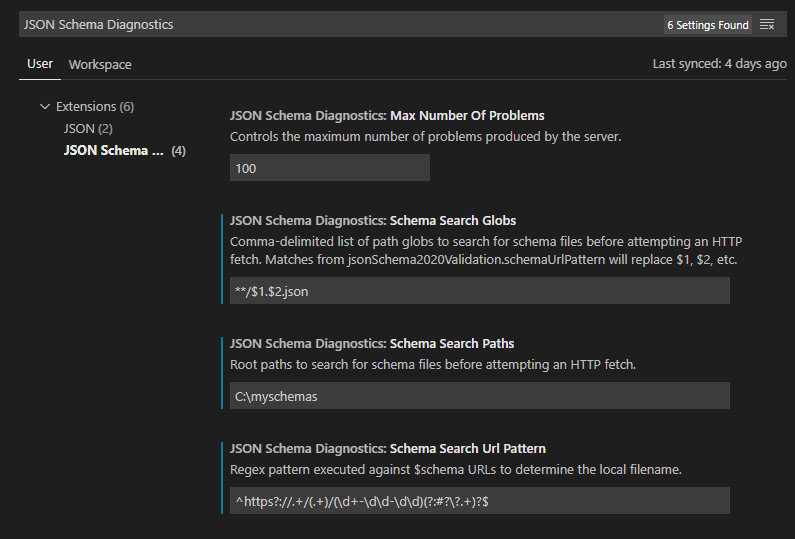

# JSON Schema Diagnostics

A JSON Schema (up to draft/2020-12) validation extension for Visual Studio Code. Provides a language server that validates JSON documents, including JSON Schema documents, against the $schema they declare.

The extension is powered by a Language Server written in C# that uses the fantastic
[JsonSchema.Net](https://www.nuget.org/packages/JsonSchema.Net/) library by Greg Dennis.

## Features

* Analyzes JSON documents as you type, adding diagnostics for any schema violations.

* Diagnostics will show up in the Problems tab, and will "red squiggle" underline the
relevant parts of the text. Supports multiple failures on the same element.

* Local schema substitution - redirect `$schema` urls to your local filesystem for faster inner-loop development.

### Local schema substitution

During development it is handy to use the real URLs that your schemas will be available from, but still be able to validate them. For example, say you have a schema that you plan to publish to https://company.com/schema/foo, but you're still creating it. Without changing your JSON, you should still be able to validate against that schema prior to publishing it.

> [!WARNING]
> Schema substitution only works for `$schema`, not `$ref`. I may add this feature if there is enough demand, but that would require hooking deeper into the guts of the schema validation library I'm using. I figured it would be more useful to get draft/2020-12 support available *now* than spend a bunch of time doing that...

To configure this, there are a few settings you can configure:

The default configuration will expect the schema filenames to match the last segment of the URL. E.g., "https://company.com/schema/foo" will match `foo` and `foo.json` in the search paths. *The first match will be used.* [More details on the Glob syntax here](https://docs.microsoft.com/en-us/dotnet/api/microsoft.extensions.filesystemglobbing.matcher?view=dotnet-plat-ext-5.0)

If you have a different pattern, adjust the Search Globs and Search Url Pattern to fit your needs. Here are a few examples:

|Url|Expected filename|Pattern to use|Glob to use|
|-|-|-|-|
|https://company.com/schema/abc/def|`abc.def.json`|`^https://.+/(.+)/(.+)$`|`$1.$2.json`|
|https://company.com/schemas?get=abc|`abc.json`|`https://.+\?get=(.+)$`|`$1.json`|
|urn://local/abc|`abc.json`|`^urn://local/(.+)$`|`$1.json`|
|urn://local/abc.json|`abc.json`|`^urn://local/(.+)$`|`$1`|

## Requirements

Supports VS Code running on Windows x64, Linux x64, and OSX.

## Known Issues

## Release Notes

0.0.8:
- Updated to .NET 8.0 (LTS)
- Added support for osx-arm64 (Apple Silicon)
- Removed support for osx-x64
- Upgraded all the packages! Man, it's been awhile.
- Fix for language server issue that would cause things to break in modern VS Code.

0.0.5:
- Added local schema substitution.
- Fixed several crashing bugs.
